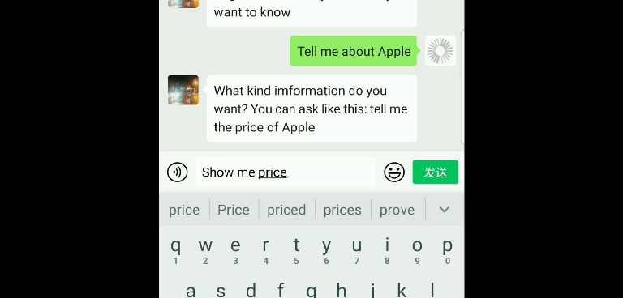

# StockBot
A wxpy-Wechat bot for stock imformation.
 
 The bot can answer questions about stock imformation, such as price, on Wechat. It uses spacy and rasa_nlu for entity extraction and 
 intent recognition of user messages. It generates responses by adding the stock imformation from iexfinance to pre-defined formats.
 
 
 # Environments:
 python==3.6.8    
 iexfinance==0.4.2    
 pandas==0.23.0   
 rasa_nlu==0.15.1   
 spacy==2.1.7   
 wxpy==0.3.9.8   

 # Functions:
 1. User log in.
 2. Recognize the intent of asking the price, volume, marketcap, and historical data of a stock and answer the question.
 3. Have multi-round dialogue.
 4. Deal with pending action.
 
 # Running:
 1. Before running, edit the name of the Wechat accounts to chat with the bot in stock_bot.py.
 2. Since a stock symbol is required to get stock data, a list of companies and their stock symbol is provided in companylist.py. 
 The company list is downloaded from: http://www.nasdaq.com/screening/companies-by-industry.aspx?&render=download. 
 Before running, copy the companylist from company_list.py and paste it to stock_bot.py or import it.
 3. Run stock_bot.py and scan the QR code displayed to deploy the bot to Wechat. 
 4. To ask stock imformation, log in with user name first. Run user_db.py to generate user database.
  
 # Notes:
 1. To be recognizable for spacy, the first letter of the company name should be capitalized. 
 2. You may receive the error 'pass_ticket' from wxpy. It means that your Wechat account is banned to log in Wehcat for Web by Tencent.  

 # Usage of the modules:  
 Iexfinance: get stock data,
 Rasa_nlu: recognize intent,  
 Spacy: extract company names in user messages.  
 
 # References:  
 [iexfinance](https://github.com/addisonlynch/iexfinance)   
 [spacy](https://spacy.io/)  
 [rasa](https://rasa.com/)  
 [wxpy](https://github.com/youfou/wxpy)   
 
      
